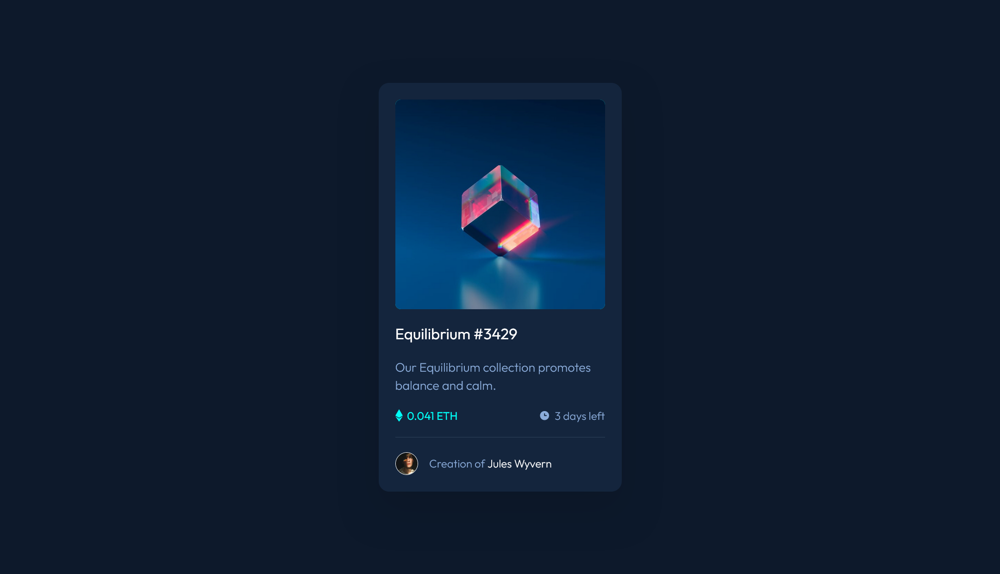

# Frontend Mentor - NFT preview card component solution

This is a solution to the
[NFT preview card component challenge on Frontend Mentor](https://www.frontendmentor.io/challenges/nft-preview-card-component-SbdUL_w0U).

## Table of contents

- [Overview](#overview)
  - [The challenge](#the-challenge)
  - [Screenshot](#screenshot)
  - [Links](#links)
- [My process](#my-process)
  - [Built with](#built-with)
  - [What I learned](#what-i-learned)
  - [Continued development](#continued-development)
  - [Useful resources](#useful-resources)
- [Author](#author)
- [Acknowledgments](#acknowledgments)

## Overview

### The challenge

Users should be able to:

- View the optimal layout depending on their device's screen size
- See hover states for interactive elements

### Screenshot

### Links

- Solution URL: [Github](https://github.com/LuisVera1/FrontendMentor-nft-preview-card)
- Live Site URL: [Solution](https://frontend-mentor-nft-preview-card-two.vercel.app/)

## My process

### Built with

- Semantic HTML5 markup
- CSS custom properties
- Flexbox
- Mobile-first workflow
- [React](https://reactjs.org/) - JS library

### What I learned

In this project I learned how to display an icon over an image, I also liked the
design.

### Continued development

I think I'm going to do a project with Javascript.

## Author

- Website - [Luisvera.dev](https://www.luisvera.dev)
- Frontend Mentor -
  [@LuisVera1](https://www.frontendmentor.io/profile/LuisVera1)
